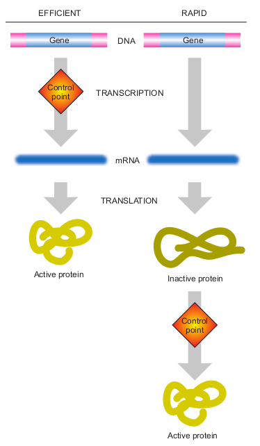

```{r setup, include=FALSE}
knitr::opts_chunk$set(echo = TRUE)
```
\newpage
## Introduction

The genetic alphabet is a simple one, consisting of just 4 letters, but it makes
up for all lifeforms known to humanity. Genes are at the centre of 
human development and differentiation. Furthermore, they play a central role in 
numerous diseases. (_remember to check_) **The latest research focused both
on diagnosis therapy, notably in oncology** is driven by the refinement of
molecular biology techniques and the advancement of [OMICS](https://en.wikipedia.org/wiki/Omics). 

The _central dogma_ states that information flows from DNA to RNA and finally to 
protein via _transcription_ and _translation_. These are the mechanisms by which
the genotype of an individual is converted to its phenotype. 
Organisms such as _E. coli_ can produce about 4,500 different proteins. Each one 
of our cells contains up to 200,000 genes. In order to maintain homoeostasis, 
cells must react and adapt to diverse stimuli. Hence, there must be a defined 
control mechanism permitting efficient and appropriate expression of genes, in
accordance to the organism's current state and its environment.

So far proteins and genes have been mentioned, but what is a gene? A gene is a 
region of the genome of the organism. 
Constituted by two parts, the _coding region_ which specifies the amino acids
that will make up the protein, and the _promoter region_, 
which allows the gene to be switched "on" or "off".

faire l'introduction après.


## The cell's congitive problem

Hello Thomas, nice to see you ! A possible method of gene control could involve the genes for all proteins 
being present in the fertilised egg. Then, during development, the selective 
loss of genes which are not required according to the cell/tissue type 
(in the case of multicellular eukaryotes) would determine gene expression. 
Under this hypothesis cells would only have _housekeeping genes_ and their 
characteristic genes. 
This would eliminate the need for additional means of gene regulation as 
regards cell differentiation. 
If this were the general case, the presence/absence of mRNA coding for specific
proteins in the cytoplasm would be matched in the DNA contents of the nucleus.

\begin{wrapfigure}{l}{5.5cm}
\caption{A wrapped figure going nicely inside the text.}\label{wrap-fig:1}
\includegraphics[width=5.5cm]{figures/two_mechanisms}
\end{wrapfigure} 

A variety of evidence suggests, however, that **selective DNA loss is not a 
general mechanism of gene control**. This is based on chromosomal, functional,
and molecular studies. It has to be noted that there are some specific cases 
in which this mechanism is used (embryonic development of some nematodes, 
crustaceans, and insects). This will not be discussed as it goes beyond the 
scope of this summary. 


<!-- ```{r, echo=FALSE, out.width="25%", fig.cap="A nice image.", fig.align = 'left'}

``` -->

The regulation of gene expression is thus, the dynamic link between the quasi
static information contained in the genome and the vast array of internal metabolic
states derived from external stimuli. 

### Extending to multicellular eukaryotes

Talk about cellular differentiation, leading to the formation of tissues, organs
and a full coordinated and integrated organism.

\newpage
## How to regulate the response ?

### Gene loss 

A possible method of gene control could involve the genes for all proteins 
being present in the fertilised egg. Then, during development, the selective 
loss of genes which are not required according to the cell/tissue type 
(in the case of multicellular eukaryotes) would determine gene expression. 
Under this hypothesis cells would only have _housekeeping genes_ and their 
characteristic genes. 
This would eliminate the need for additional means of gene regulation as 
regards cell differentiation. 
If this were the general case, the presence/absence of mRNA coding for specific
proteins in the cytoplasm would be matched in the DNA contents of the nucleus.

A variety of evidence suggests, however, that **selective DNA loss is not a 
general mechanism of gene control**. This is based on chromosomal, functional,
and molecular studies. It has to be noted that there are some specific cases 
in which this mechanism is used (embryonic development of some nematodes, 
crustaceans, and insects). This will not be discussed as it goes beyond the 
scope of this summary. 

### Gene amplification 

Having discarded _gene loss_ as a general means of gene control, we must examine
the role _gene amplification_ in the regulation of gene expression. Under this
hypothesis, selective amplification of genes would account for the observed 
expression profile (mRNA and protein concentrations), keeping normal 
transcription and translation rates. Unlike the _gene loss_ or _gene-deletion_
models, this proposed mechanism is not incompatible with renowned 
experiments such as the cloning of Dolly[^1], achieved via nuclear transfer from
an adult somatic cell into an unfertilised oocyte. 

As with _gene loss_, the identity of the chromosomal complement in individual 
cell types provides strong evidence against the occurrence of large-scale _DNA
amplification_. Furthermore, the evidence coming from molecular studies such as
_Southern blotting_ sustains the premise that across different tissues, 
the number of copies of each gene stays constant. As mentioned previously, this
discards _gene amplification_ as the general regulation mechanism, although 
it happens under certain normal and pathological conditions. Two cases are the
amplification of ribosomal DNA during embryonic development of multicellular 
organisms and oncogene amplification in some cancer cells.


[^1]: Add the reference 

### DNA REARRANGEMENT (perhaps not?)

Both _gene amplification_ and _gene loss_ are possible mechanisms of gene regulation,
but as previously stated, they seldom happen in specific contexts. 
In addition, the previously stated _gene regulation hypotheses_ would 
only account for tissue-specific cellular differentiation in 
multicellular eukaryotes, having no validity in unicellular organisms. 
An example of gene expression as a response
to external stimuli is the case of the _lac operon_ of _E. coli_. 
In a study of a wide range of yeast proteins and mARNs, these two generally 
had a strong positive correlation. These where measured via two-dimensional
gel electrophoresis and a gene chip methods respectively.

From this brief discussion and the positive correlation of
mRNA and protein concentrations, we can conclude that gene regulation must 
predominantly operate to produce different amounts of mRNA from a select
subset of all the genes ubiquitously present. **The key to gene expression must
lie therefore in the process of _transcription_**.


### Transcription

Transcription must be therefore 
explicación a grosso modo de la transcripción

## Procaryote 

The process of gene expression or gene regulation is mainly mediated via transcription.
We must therefore understand the bases of this process to discuss gene expression.
Bacteria can regulate gene expression via DNA-binding proteins. 
These can be categorised either as **repressors** or **activators**, which can be 
subject to allosteric regulation themselves. 
The core transcription process in prokaryotes is explained by the **operon model**. 

An _operon_ is a segment of DNA that consists of a regulatory section and 
a coding section.
The _regulatory section_ consists of a sequence of DNA with control sites known 
as the _promoter_ and the _operator_ site.
The _coding section_ contains the gene(s) that code for the polypeptide(s) that
will make up the protein(s).


hablar a detalle, AK lectures

## Eucaryote

hablar a detalle, AK lectures

## Transcriptional networks, current issues, data mining, etc

## Conclusion : biologie integrative, etc.

\newpage
# Glossary

* **Gene**: The unit of inheritance, "a particulate factor that passes unchanged from generation to generation".

* **Deoxyribonucleic acid**: The chemical constituents of the gene segments, comprising nucleotides and a sugar phosphate
backbone, incorporated into a double helical structure.

* **Nucleotide**: The building blocks of the gene that specify the genetic alphabet. There are two types of nucleotide, purines and
pyrimidines.
* **Pyrimidines**: A nitrogenous base with a six membered ring eg Cytosine and Thymine.
* **Purines**: A nitrogenous base with fused 5 and 6 membered rings eg Adenine and Guanine.
* **Genotype**: The genetic composition of an individual.
* Phenotype: The physical expression of the genotype.
* **Allele**: the particular form of the gene (all genes except genes on the Y chromosome have 2 copies in humans).
* **Homozygote**: both alleles of a gene inherited from maternal and paternal are identical for the trait of a particular gene.
* **Heterozygote**: The alleles of a gene inherited from maternal and paternal are different.
* **Dominant**: the presence of one allele is sufficient to provide the phenotype of the individual.
* **Recessive**: the presence of both alleles is required to provide the phenotype of the individual.
* **Locus**: The physical position of the gene.
* **Polymorphism**: a change at the nucleotide level between the genomes of two individual at a specific locus. This may take
the form of a single base change, or a change in the number of repetitive elements at this locus. Many polymorphisms
are neutral, having no definable phenotype.
* **Eukaryotic**: referring to the genome of multicellular organisms, from yeast to humans genes are interrupted by introns.
* **Prokaryotic**: referring to the single cell organisms such as bacteria, archaebacteria etc, no introns present.

# References
```{r generateBibliography, results="asis", echo=FALSE}
suppressMessages(require("bibtex"))
suppressMessages(require("knitcitations"))
cleanbib()
options("citation_format" = "pandoc")
read.bibtex(file = "references.bib")
``` 
